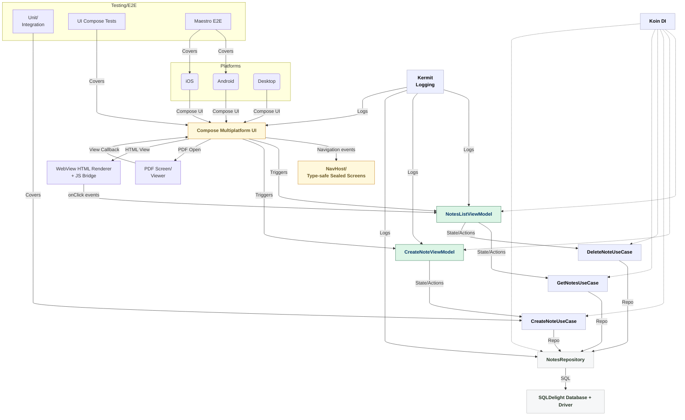

<div align="center">
  

  <h1>Notes App</h1>
</div>

---

## ✨ Brief Description

<strong>Notes App</strong> is a personal note-taking application built with Compose Multiplatform. Effortlessly create,
edit, and organize your notes—each note includes a title, body (HTML supported), and created date. Fast, beautiful, and
works on Android, iOS, and Desktop(Only for development purposes).

---

## 🎥 Demo Android & iOS

<table>
  <tr>
    <td><video src="https://github.com/user-attachments/assets/416597a4-1b73-435d-b69d-fbf9a6ab5f1b"></video></td>    
    <td><video src="https://github.com/user-attachments/assets/5b96ecf6-a1a3-476d-92e7-24a913b88428"></video></td>
  </tr>
</table>

---

### 🤖 APK link: [Notes App](https://github.com/aryapreetam/notes-app/releases/download/v1.0.0/NotesApp.apk) 

## 🗂️ Project Structure & Architecture

### Directory Structure (Key parts)

```text
composeApp/src/commonMain/kotlin/org/notesapp/
├── data/               // DB, models, repository impls
├── domain/             // UseCases for business logic
├── presentation/       // Composables, navigation, UI state, screens
├── di/                 // Koin modules
├── theme/              // Material3 expressive themes
├── utils/              // Utilities/helpers (date, platform)
```

### Architecture Diagram



---

## 🏛️ Architecture Explanation

- <strong>Multiplatform MVVM:</strong> Dumb/reactive UI with ViewModels driving all state and business logic,
  independently testable.
- <strong>Navigation:</strong> Type-safe sealed class screens, custom NavHost composable.
- <strong>Dependency Injection:</strong> Koin modules (per layer: db, repo, usecase, viewmodel) for scalable, testable
  design.
- <strong>Data:</strong> SQLDelight for strongly-typed, multiplatform SQLite with platform-specific drivers.
- <strong>UI:</strong> Material3 Expressive with custom themes/components. Pure Compose with state as single source of
  truth.
- <strong>HTML & PDF:</strong> Rich-text body using WebView widgets and PDF Viewer component.
- <strong>Testing:</strong> Unit, UI Compose, and Maestro E2E (all implemented and passing).
- <strong>Logging:</strong> Kermit logger everywhere, no PII.
- <strong>Platform abstraction:</strong> actual/expect code for database drivers, date formatting, and native
  integrations.

---

## 🚀 Installation & Usage
```agsl
git clone https://github.com/aryapreetam/notes-app.git
cd notes-app
./gradlew :composeApp:assembleDebug
```

### Prerequisites

- JDK 17+
- Android Studio OR Xcode (for iOS)
- [KDoctor](https://github.com/Kotlin/kdoctor) for KMP environment check
- Android SDK path set in `local.properties`

### Android

- Open the project in Android Studio
- Run on device/emulator using run configuration
- Build APK: `./gradlew :composeApp:assembleDebug` (APK in `composeApp/build/outputs/apk/debug/composeApp-debug.apk`)
- Run UI tests: `./gradlew :composeApp:connectedDebugAndroidTest`

### Desktop

- Run app: `./gradlew :composeApp:run`
- Hot reload: `./gradlew :composeApp:hotRunJvm`
- Run desktop UI tests: `./gradlew :composeApp:jvmTest`

### iOS

- Open `iosApp/iosApp.xcproject` in Xcode, run standard configuration
- Or use the [KMM Plugin for Android Studio](https://plugins.jetbrains.com/plugin/14936-kotlin-multiplatform-mobile)
- Run iOS UI tests: `./gradlew :composeApp:iosSimulatorArm64Test`

---

## 🧪 Running Tests

- **Unit tests (domain, repository, utils):**
    - `./gradlew :composeApp:commonTest`
- **UI Compose tests:**
    - Android: `./gradlew :composeApp:connectedDebugAndroidTest`
    - Desktop: `./gradlew :composeApp:jvmTest`
- **End-to-End (Maestro E2E):**
    - Run: `maestro test maestro-e2e`
    - (Make sure you have installed Maestro CLI; see below)

## 🏃 Maestro End-to-End Testing

To run E2E tests, you need [Maestro](https://maestro.mobile.dev/) installed:

```sh
# Mac OS (recommended):
brew install maestro

# Or for all platforms (see official docs):
curl -Ls "https://get.maestro.mobile.dev" | bash
```

Then, run all E2E tests for this project:

```sh
# run below command from project root
maestro test maestro-e2e
```

```sh
# output
Waiting for flows to complete...                                                                                                                                                                                            
[Passed] noteslist_empty_state (19s)
[Passed] note_create_and_delete (1m 43s)
[Passed] note_interactions (1m 53s)
[Passed] overflow_pdf_viewer (36s)

4/4 Flows Passed in 4m 31s
```

---

## 📚 Libraries Used

- <strong>UI:</strong> JetBrains Compose Multiplatform, Material3 Expressive
- <strong>Dependency Injection:</strong> Koin (core, compose, viewmodel)
- <strong>Database:</strong> SQLDelight (core, coroutines, multiplatform drivers)
- <strong>Testing:</strong> Kotlinx Test, Compose UI Test, Maestro (End-to-end)
- <strong>Platform Integration:</strong> Compose WebView Multiplatform, Bouquet (PDF on Android), `platform.PDFKit` (PDF on iOS), kotlinx.datetime
- <strong>Logging:</strong> Kermit

---

## ⬇️ How HTML Clicks and PDF Are Handled

- <strong>HTML Body/Clicks:</strong> Notes can include HTML body, displayed in a Compose WebView. Clicks inside HTML (
  links, buttons) are handled with a custom JS Bridge (see `NoteCard.kt`), which sends events from the WebView back to
  the UI(handled via `IJsMessageHandler`) for further actions. 
- <strong>PDF Viewing:</strong> Notes, or screens, can open PDF links in a dedicated PDF Viewer screen/component.
  Currently, Android PDF UX may be improved—see TODOs below.

---

## 📝 To Be Done

1. Enhanced form and field validations (especially for HTML/body)
2. Cross-platform PDF renderer improvements (especially on Android—smoother navigation/UI)
3. iOS/desktop performance optimizations for large notes

---

Happy note-taking! 🚀

